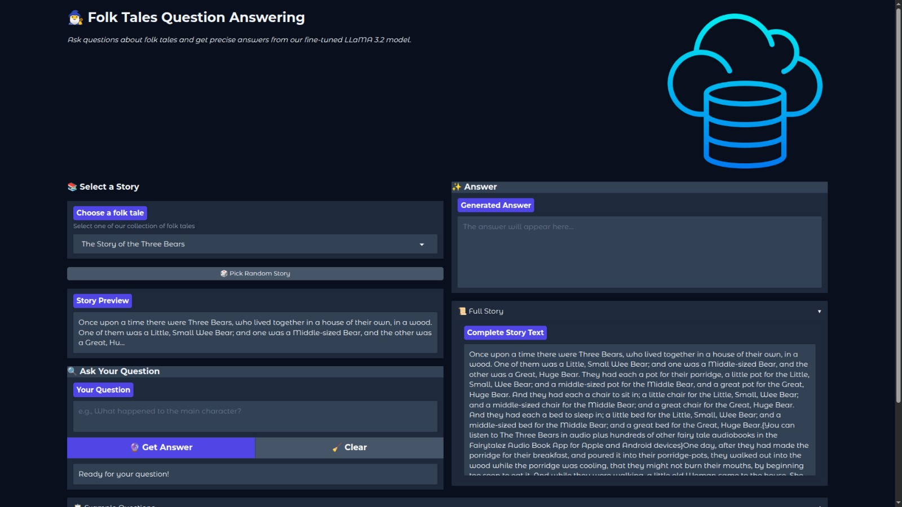

# 🧙‍♂️ Enchanted Tales: Folk Story QA Engine 📖

Welcome to Enchanted Tales! This project brings folk stories to life by creating a question-answering system powered by a fine-tuned Large Language Model (LLM). It automatically scrapes stories, generates relevant question-answer pairs, and trains a model to understand and respond to queries about these tales. Finally, it provides an easy-to-use web interface for interaction.



---

## ✨ Core Features

*   **🤖 Automated Story Scraping:** Uses Selenium to log in and scrape folk tales from [fairytalez.com](https://fairytalez.com/).
*   **❓ QA Pair Generation:** Leverages an LLM (e.g., Qwen) via Langchain to automatically create question-answer pairs based on the scraped stories.
*   **🧠 LLM Fine-tuning:** Fine-tunes a Llama 3.2-3B model using Parameter-Efficient Fine-Tuning (PEFT) with LoRA on the generated QA dataset. Includes semantic context retrieval using Sentence Transformers for better relevance.
*   **📊 Model Evaluation:** Evaluates the fine-tuned model using standard NLP metrics like BLEU, ROUGE, and BERTScore.
*   **💬 Interactive Web UI:** Provides a user-friendly Gradio interface (`app.py`) to select a story, ask questions, and receive answers from the fine-tuned model.

---

## 🛠️ Technology Stack

*   **Programming Language:** Python 3.x
*   **Web Scraping:** Selenium, BeautifulSoup4
*   **Data Handling:** Pandas
*   **LLM Interaction:** Langchain, OpenAI-compatible API
*   **NLP &amp; ML:** Transformers (Hugging Face), PEFT (Parameter-Efficient Fine-Tuning), TRL (Transformer Reinforcement Learning), SentenceTransformers, PyTorch, Scikit-learn
*   **Web Interface:** Gradio
*   **Environment Management:** dotenv
*   **Base Model:** meta-llama/Llama-3.2-3B-Instruct

---

## ⚙️ Project Workflow

1.  **Scrape Stories (`selenium_scrapper.py`):**
    *   Logs into `fairytalez.com`.
    *   Navigates through a list of story URLs.
    *   Extracts story titles and content.
    *   Saves data to `Final_stories.csv`.
2.  **Generate QA Pairs (`qa_gen.py`):**
    *   Reads stories from a CSV (e.g., `100_stories.csv` - *ensure this matches your scraped output or adjust script*).
    *   Sends story text to an LLM API to generate QA pairs.
    *   Parses responses and saves QA pairs to `question_answer_pairs_final.csv`.
3.  **Fine-tune Model (`finetuning.py`):**
    *   Loads the QA dataset and original stories.
    *   Uses Sentence Transformers to find relevant text chunks for each question (semantic search).
    *   Formats data into a chat template including relevant context.
    *   Fine-tunes the Llama 3.2-3B model using LoRA and SFTTrainer.
    *   Saves the fine-tuned adapter weights to `llama3.2-3B-Fine-tuned-QA/`.
    *   Evaluates the model performance.
4.  **Run Interactive App (`app.py`):**
    *   Loads the base Llama 3.2 model and the fine-tuned LoRA adapter.
    *   Loads story data (e.g., `250_stories.csv` - *ensure this file exists and contains the stories you want to query*).
    *   Launches a Gradio web interface allowing users to select stories and ask questions.

---

## 🚀 Getting Started

### 1. Prerequisites

*   Python 3.8+
*   Git
*   Access to an OpenAI-compatible LLM API (for QA generation).
*   A [fairytalez.com](https://fairytalez.com/) account (for scraping).
*   A Hugging Face account and API token (for downloading models and fine-tuning).
*   Google Chrome or Brave browser installed.
*   ChromeDriver matching your browser version. Download [here](https://chromedriver.chromium.org/downloads).

### 2. Clone the Repository

```

git clone <your-repository-url>
cd <your-repository-name>

```

### 3. Set Up Virtual Environment (Recommended)

```

python -m venv venv
source venv/bin/activate  \# On Windows use `venv\Scripts\activate`

```

### 4. Install Dependencies

Create a `requirements.txt` file with all necessary libraries listed in the Python scripts (e.g., pandas, selenium, beautifulsoup4, langchain, transformers, peft, trl, datasets, sentence-transformers, torch, scikit-learn, gradio, python-dotenv, bitsandbytes, accelerate, rouge-score, bert-score, torchmetrics) and install them:

```

pip install -r requirements.txt

```
*(You might need to create this `requirements.txt` file based on the imports in your scripts)*

### 5. Configure Environment Variables

Create a `.env` file in the root directory of the project and add the following variables:

```


# For selenium_scrapper.py

USERNAME="your_fairytalez_username_or_email"
PASSWORD="your_fairytalez_password"

# For qa_gen.py (Replace with your LLM endpoint details)

BASE_URL_HERE="your_llm_api_base_url"
API_KEY_HERE="your_llm_api_key"

# For finetuning.py

HUGGINGFACE_TOKEN="your_huggingface_api_token"

```

**Important:** Update the `executable_path` for ChromeDriver in `selenium_scrapper.py` to point to your downloaded ChromeDriver location.

---

## ▶️ Running the Project

Follow these steps sequentially:

### Part 1: Scrape Folk Stories

Ensure you have:
*   A `folk_tales_links.csv` file in `Datasets/` containing the URLs to scrape (column name `source`).
*   Your `.env` file configured with `USERNAME` and `PASSWORD`.
*   ChromeDriver path correctly set in `selenium_scrapper.py`.

Run the scraper:
```bash
python selenium_scrapper.py
```
This will create `Final_stories.csv` (or append to it) containing the scraped story URLs, titles, and text, separated by `###`.

**Note:** You might need to adjust the script (e.g., number of stories to scrape, selectors if the website changes). Prepare a source CSV (e.g., `100_stories.csv` used in `qa_gen.py`) based on this output, ensuring the delimiter is correct (`#` is expected by `qa_gen.py`).

### Part 2: Generate Question-Answer Pairs

Ensure you have:
*   Your story data prepared (e.g., `100_stories.csv` with `#` delimiter, columns `title` and `story`).
*   Your `.env` file configured with `BASE_URL_HERE` and `API_KEY_HERE`.

Run the QA generation script:
```bash
python qa_gen.py
```
This will:
1.  Read stories from `./data/100_stories.csv` (adjust path/filename if needed).
2.  Call the LLM API to generate QA pairs.
3.  Save raw responses to `qa_pairs.txt`.
4.  Save formatted QA pairs to `question_answer_pairs_final.csv` (columns: `Index`, `Question`, `Answer`, separated by `#`).

### Part 3: Fine-tune the LLM

Ensure you have:
*   The generated `question_answer_pairs_final.csv`.
*   The corresponding story file (e.g., `100_stories.csv`).
*   Your `.env` file configured with `HUGGINGFACE_TOKEN`.
*   Sufficient compute resources (GPU highly recommended).

Run the fine-tuning script:
```bash
python finetuning.py
```
This will:
1.  Load the base Llama 3.2-3B model and tokenizer.
2.  Load and preprocess the QA data and stories.
3.  Perform semantic search for context retrieval.
4.  Fine-tune the model using LoRA.
5.  Save the adapter weights to the `llama3.2-3B-Fine-tuned-QA/` directory.
6.  Evaluate the model and print BLEU, ROUGE, and BERTScore metrics.

### Part 4: Launch the Gradio Web Interface

Ensure you have:
*   The fine-tuned model adapter saved in `llama3.2-3B-Fine-tuned-QA/`.
*   A story CSV file accessible by `app.py` (the script currently uses `250_stories.csv` with `#` delimiter - **make sure this file exists and is correctly formatted, or update the path in `app.py`**).

Run the Gradio application:
```bash
python app.py
```
This will:
1.  Load the base model and the fine-tuned adapter.
2.  Load the story data.
3.  Launch a web server with the Gradio interface.
4.  Provide a URL (usually `http://127.0.0.1:7860` or a public share link) to access the application in your browser.

Now you can interact with your fine-tuned Folk Tale QA Engine! Select a story, ask a question, and get an AI-generated answer based on the story's context.

---

## 📈 Evaluation

The fine-tuning script (`finetuning.py`) includes an evaluation step using the following metrics to assess the quality of the generated answers against the reference answers in the test set:

*   **BLEU:** Measures precision of n-grams.
*   **ROUGE (ROUGE-1, ROUGE-2, ROUGE-L):** Measures recall of n-grams and longest common subsequence.
*   **BERTScore:** Measures semantic similarity using contextual embeddings.

The evaluation results are printed to the console after training.

---
## 🎬 Demo

Check out our project in action!

<div align="center">
    <video src="./Assets/video.mp4" width="640" height="360" controls></video>
</div>


https://github.com/user-attachments/assets/e81819ab-3e15-453b-ab16-a751940aee38


*Note: If the video doesn't play directly in your browser, you can download it by clicking [here](./Assets/video.mp4).*

---
## 📝 Presentation 🎭

You can download our detailed project presentation from [here](./Assets/Folk_Tale_Question_Answering_NLP.pdf).

<!-- <embed src="./Assets/Folk_Tale_Question_Answering_NLP.pdf" type="application/pdf" width="100%" height="600px" />

*Note: If the PDF doesn't load directly in your browser, you can download it by clicking [here](./Assets/Folk_Tale_Question_Answering_NLP.pdf).* -->


---


Happy Storytelling! 🧚‍♀️📜


